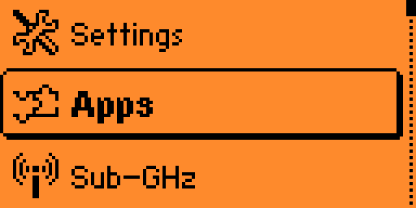
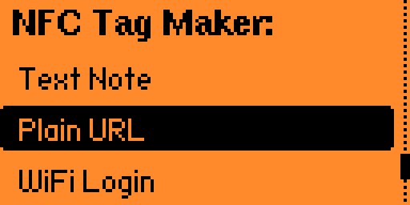
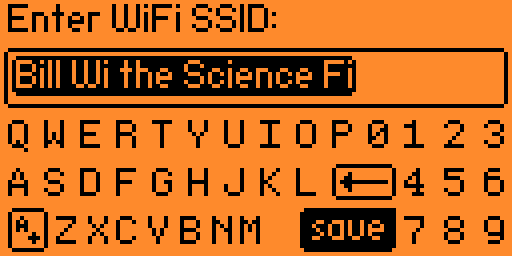
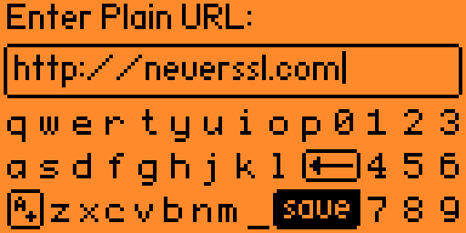
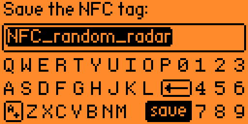
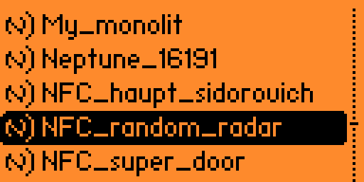
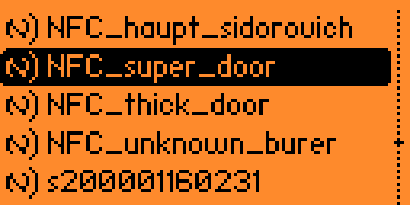

# LAB: Create a tag

The objective of this lab is to create an NFC tag from scratch. We will be making a tag that when scanned with a phone will prompt a user to visit a specific website.

First, navigate to the Apps view:

Then navigate to the NFC folder:

And select the NFC Maker app:

This app lets you create many different types of NFC tags, but we want to create a non-SSL URL, so we select "Plain URL"

