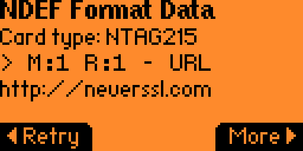

# LAB: Create a tag

The objective of this lab is to create an NFC tag from scratch. We will be making a tag that when scanned with a phone will prompt a user to visit a specific website.

First, navigate to the Apps view:

Then navigate to the NFC folder:

And select the NFC Maker app:

This app lets you create many different types of NFC tags, but we want to create a non-SSL URL, so we select "Plain URL":

On the next screen we type in the URL we want to program to the tag. Note that if you do not want to use SSL, you have to scroll back to the beginning of the URL screen and remove the "s" in "https":

Hit "save" and then either give the tag a memorable name, or take note of the auto-generated name:

We should get a thumbs up for a well-saved tag:

Now we go into the main "NFC" app:

And select the "saved" option:

And open up the tag we just created:

And select "write":

Put your flipper next to an NTAG215 which is writable:

Good job!

If you read it again with the NFC app, this is what it looks for:

