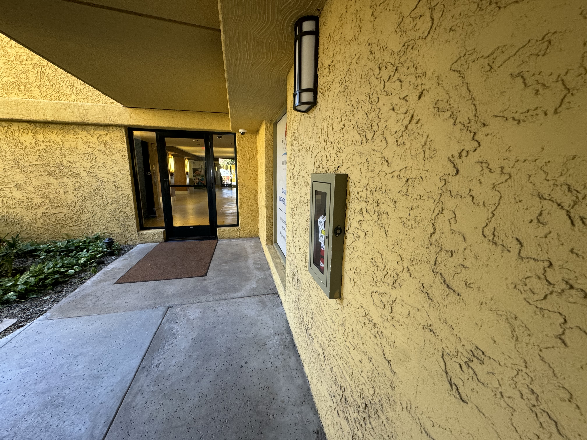
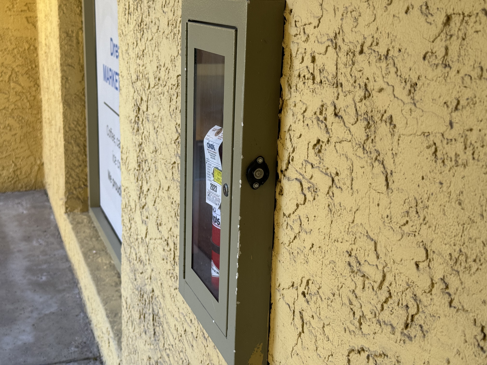
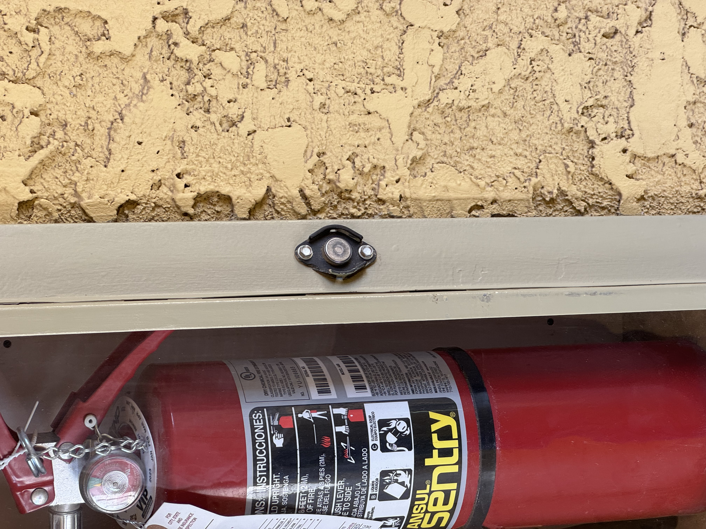
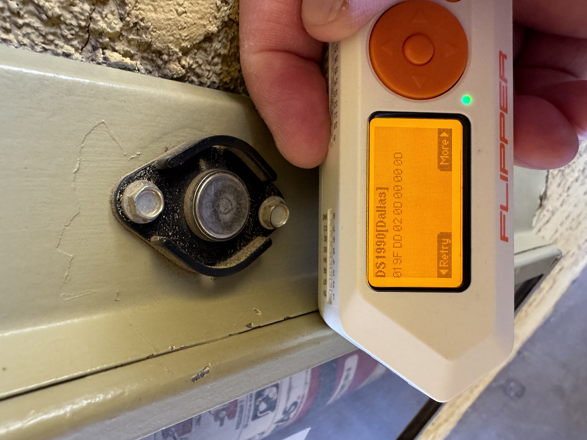

There are dozens of iButtons spread around the hotel property.

Here are two examples:

Your challenge between now and the class tomorrow is to gather dumps and geotagged photos (include context in photo) of as many iButtons as you can find.

Email a link to a collection of photos and a text file/.csv with the following info:

| iButton Serial Number | Location Description | Image Filename |
| ------------- | ------------- | ------------- |
| 01 91 A8 FD 0C 00 00 E1 | Outside Dreamy Draw | IMG_5350.JPG | 
| 01 2B 75 FF 0C 00 00 9C | Outside Room 2142 | IMG_5337.jpg | 

### Sources, references and further reading

* https://docs.flipper.net/ibutton
