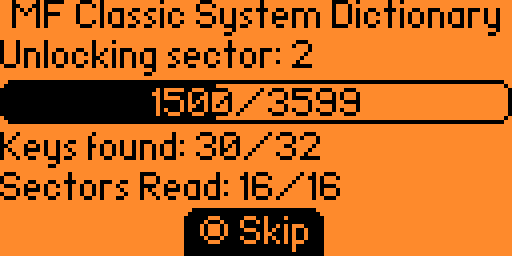
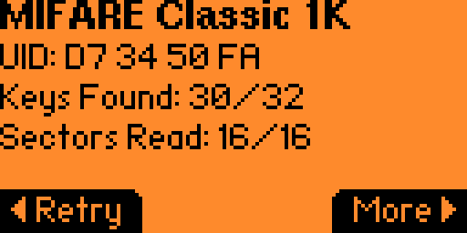
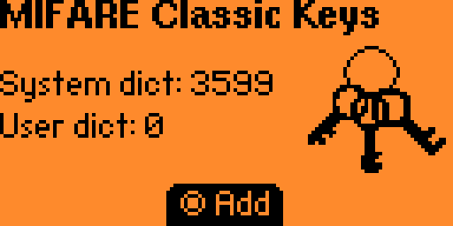
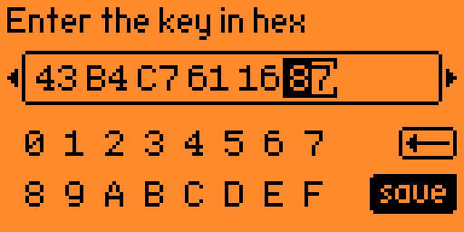
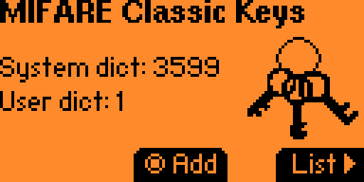
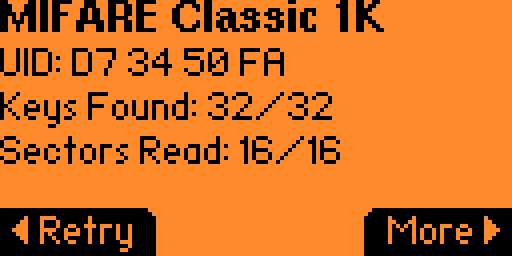

The goal of this lab is to familiarize yourself with an NFC card.

Each student is provided with a lab card for this lab. It is marked with "MFC".

Put the card under the flipper and launch the NFC app. Read the card.

The app will try to unlock all of the sectors and read them all:

After a few minutes, the flipper will exhaust all of the keys included with the firmware and shows this screen:

Hit the right button to see “More”, then down to the “Info” screen:



The info on this screen includes the card type and the Unique ID.

Select “More” on this screen to see a hex display of the card contents. But since we didn’t read with all of the keys, data is missing. 

Scroll down until you find some missing data:

Save the card data we have so far using the Save function.

Currently the flipper doesn’t have a way to crack keys with just the card[^1]. For now I will provide you with the key.

Now we will add the missing key for this card. In the NFC app, select “Extra Actions” and then “MIFARE Classic Keys”:

Select “Add” and then add the following key:

43 B4 C7 61 16 87

Read the card again:

Save the card to a new file and view the “More” for the card. The data now is complete without any ?’s.

[^1]: https://github.com/AloneLiberty/FlipperNested/wiki/Usage-guide
